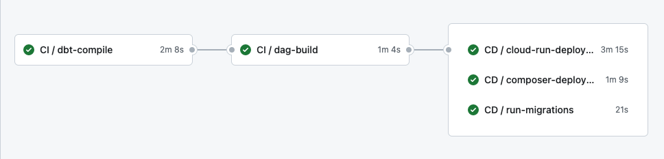

This project is a model example for building and handling database warehouses using `DBT` (to build aggregated data) with `Airflow` as an orchestrator.

The data warehouse works as the following:
   - We use `alembic` to manage source tables migrations
   - We use `DBT` to build aggregation tables that can be queried later by users and apps.
   - We compile `DBT` code and hack the `manifest.json` to obtain the DAG used by it and convert it to an `airflow` dag.
   - The `airflow` dag will be sent to `cloud composer` to orchestrate all the DBT jobs.

As you can notice, there project includes many steps (dbt compile, dag translation, jobs orchestration, ...), we will then use `github actions` to define a workflow that can handle deployment automatically. 

PS: The `DBT jobs` will be executed on a dedicated cloud run. The cloud run will execute jobs asynchronously and `cloud composer` will ask periodically for the job's status after submitting it.

### Github actions workflow:

1. First level: We compile dbt to obtain  the `manifest.json` file in the dbt `target` directory.
2. Second level: We use the `manifest.json` and apply `devops/generate_dbt_dag.py` to obtain a `.py` dag file.
3. At this level, we go to cloud.
   1. We create a cloud run to execute dbt models run/test
   2. We send dag file (it may contain many dags based on `selectors.yml`) to composer
   3. We apply `alembic` migrations to sources.

### Use dbt locally
To use dbt:
- Install requirements from `requirements.txt`
- `cd dbt_airflow`
- Set the environment variable `DBT_PROFILES_DIR` to the path of the current directory `dbt_airflow`
- Run the dbt commands (dbt run, dbt test, dbt ls, ...)

### DBT Resources:
- Learn more about dbt [in the docs](https://docs.getdbt.com/docs/introduction)
- Check out [Discourse](https://discourse.getdbt.com/) for commonly asked questions and answers
- Join the [chat](https://community.getdbt.com/) on Slack for live discussions and support
- Find [dbt events](https://events.getdbt.com) near you
- Check out [the blog](https://blog.getdbt.com/) for the latest news on dbt's development and best practices

